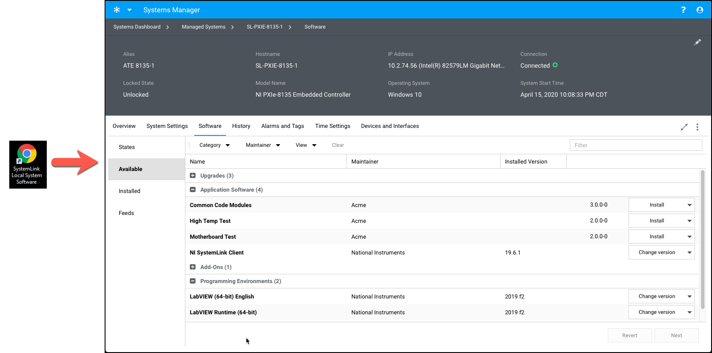

# systemlink-generate-shortcut-to-local-system-software-tab
 
Run this LabVIEW 2017 VI (or corresponding built EXE) to generate a Desktop shortcut that directly launches the SystemLink web UI for the local SystemLink Client's SystemLink Software tab, as shown below.

Note: Before running this VI (or EXE), make sure that the local system has already successfully connected to and been approved by a SystemLink Server.

